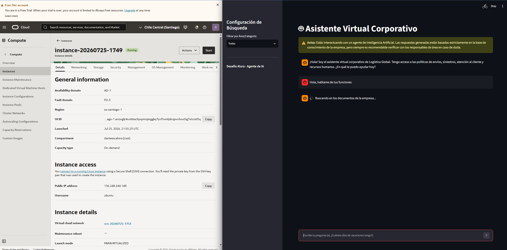
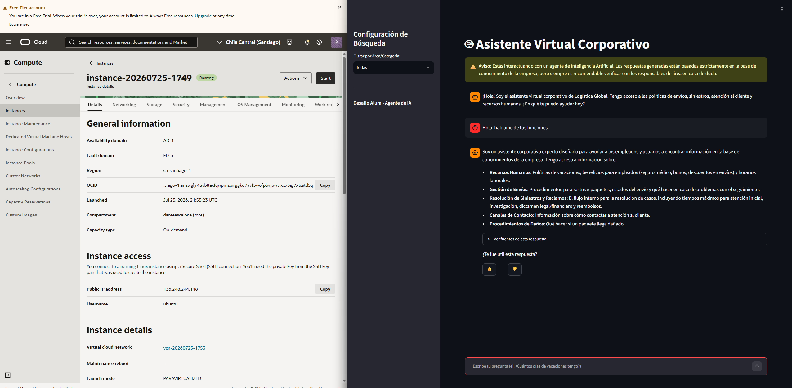

# 🤖 Agente de IA Corporativo - Desafío Alura

Un **Agente de Inteligencia Artificial Corporativo** desarrollado como parte del desafío de Alura. Este proyecto implementa un sistema RAG (Generación Aumentada por Recuperación) que permite a los empleados de una empresa consultar información interna contenida en diversos formatos de documentos con alta precisión, citando siempre las fuentes.

## ✨ Características Principales

- **Soporte Multi-Formato**: Procesa documentos en PDF, Word (.docx), Excel (.xlsx), PowerPoint (.pptx), Markdown, CSV, JSON y HTML.
- **Búsqueda Semántica Avanzada**: Utiliza `ChromaDB` como base de datos vectorial y `GoogleGenerativeAIEmbeddings` para encontrar la información más relevante.
- **Filtro por Metadatos**: Permite realizar consultas sobre toda la base de datos o restringirlas a categorías específicas (ej. RH, Legal, Finanzas).
- **Interfaz Intuitiva**: Chatbot web construido con **Streamlit**, con historial de conversación, advertencia de IA y sistema visual de feedback (👍/👎).
- **Trazabilidad y Logging**: Cada consulta, fuente utilizada, respuesta y tiempo de ejecución se registra localmente en formato JSONL (`logs.jsonl`) para auditorías.
- **Listo para la Nube**: Empaquetado con Docker para un despliegue sencillo en Oracle Cloud Infrastructure (OCI).

## 🛠️ Stack Tecnológico

- **Lenguaje**: Python 3.10
- **Framework IA**: LangChain
- **LLM & Embeddings**: Google Gemini (`gemini-1.5-pro-latest`)
- **Vector Store**: Chroma
- **Frontend**: Streamlit
- **Contenedores**: Docker

## 📂 Estructura del Proyecto

```text
📁 Proyecto Oracle Cloud/
├── 📁 docs/                 # Documentos fuente categorizados
│   ├── 📁 Atencion_Cliente/ # FAQ y Reclamos (JSON, Markdown)
│   ├── 📁 Envios/           # Políticas de envíos y rastreo (Markdown, HTML)
│   └── 📁 Siniestros/       # Políticas de siniestros (CSV)
├── 📁 src/                  # Código fuente
│   ├── agent.py             # Lógica RAG, Chunking, Embeddings y Logging
│   └── app.py               # Interfaz web de Streamlit
├── Dockerfile               # Configuración para contenerización
├── requirements.txt         # Dependencias de Python
├── setup_docs.py            # Script para generar documentos de prueba
└── README.md                # Este archivo
```

## 🚀 Instalación y Uso Local

1. **Clonar el repositorio:**
   ```bash
   git clone <TU_URL_DE_GITHUB>
   cd "Proyecto Oracle Cloud"
   ```

2. **Configurar la API Key:**
   Renombra el archivo `.env.example` a `.env` e inserta tu clave de API de Google:
   ```env
   GOOGLE_API_KEY=tu_api_key_aqui
   ```

3. **Instalar dependencias:**
   ```bash
   pip install -r requirements.txt
   ```

4. **Ejecutar la aplicación:**
   ```bash
   cd src
   streamlit run app.py
   ```
   La aplicación estará disponible en `http://localhost:8501`.

---

## ☁️ Despliegue en Oracle Cloud Infrastructure (OCI)

Para cumplir con el requerimiento de alta disponibilidad y acceso para todos los colaboradores, este proyecto está preparado para desplegarse en **OCI Compute**. 

### Pasos para el Despliegue:

1. **Crear una Instancia Compute en OCI:**
   - Inicia sesión en tu consola de Oracle Cloud.
   - Ve a **Compute > Instances** y haz clic en "Create Instance".
   - Selecciona una imagen de SO (ej. Ubuntu 22.04) y la forma (Shape) adecuada (la capa gratuita Ampere A1 o AMD micro funciona perfectamente).
   - Descarga tus claves SSH (pública y privada) y lanza la instancia.

2. **Configurar Reglas de Red (VCN):**
   - En los detalles de la instancia, ve a la subred (Subnet) y luego a los **Security Lists**.
   - Añade una regla de entrada (Ingress Rule) para permitir tráfico TCP en el puerto `8501` (el puerto de Streamlit) desde `0.0.0.0/0`.

3. **Conectarse e Instalar Docker:**
   - Conéctate a tu VM por SSH: `ssh -i clave.key ubuntu@<IP_PUBLICA>`
   - Instala Docker:
     ```bash
     sudo apt update
     sudo apt install docker.io -y
     sudo systemctl start docker
     sudo systemctl enable docker
     ```

4. **Clonar y Ejecutar el Contenedor:**
   - Clona tu repositorio en la VM.
   - Construye la imagen de Docker:
     ```bash
     sudo docker build -t agente-corporativo .
     ```
   - Ejecuta el contenedor, pasando tu API Key como variable de entorno:
     ```bash
     sudo docker run -d -p 8501:8501 -e GOOGLE_API_KEY="tu_api_key_aqui" agente-corporativo
     ```

5. **¡Listo!** Accede a tu agente desde cualquier navegador usando `http://<IP_PUBLICA_DE_OCI>:8501`.

## 🎥 Demostración

**🟢 Enlace en vivo:** [http://144.22.63.170:8501](http://144.22.63.170:8501)  
*(Nota: El servidor Oracle Cloud podría estar apagado o reiniciándose si intentas acceder meses después del desafío).*




---

💡 **Nota sobre el Logging:** 
Durante la ejecución, todas las preguntas y respuestas se guardarán en el archivo `src/logs.jsonl`. En un entorno productivo robusto en OCI, estos logs pueden ser ingeridos por **OCI Logging** Analytics para monitoreo en tiempo real.
